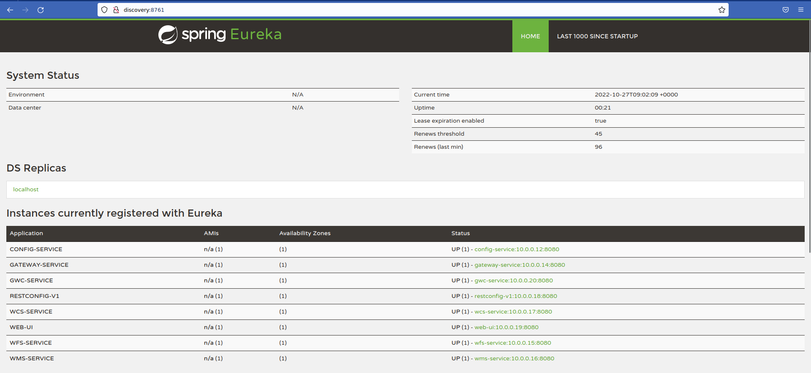
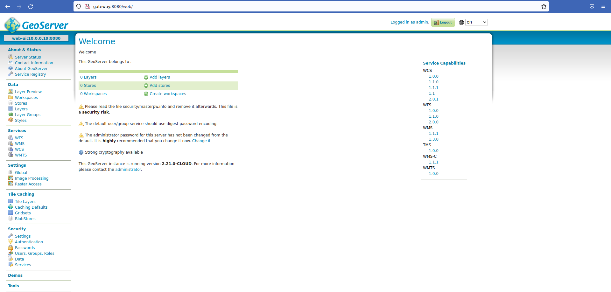

# Abstract

L'objet de ce document est d'expliquer comment déployer un [Geoserver Cloud](https://github.com/geoserver/geoserver-cloud) hors docker, dans un environnement de "machines virtuelles classiques".

A des fins de prototypage, nous avons réalisé une installation dans un ["fork" du projet sur github](https://github.com/pmauduit/geoserver-cloud/tree/vagrant-virtualbox-ansible-deployment), utilisant les outils vagrant, virtualbox et  ansible pour automatiser l'installation et la configuration des différents services.

# Découpage des services en VM

La première question qu'il convient de se poser est de déterminer comment cloisonner les différents services composant *GeoServer Cloud* ou ceux dont celui-ci sont des dépendances dans différentes machines virtuelles.

Pour résumer, nous aurons besoin de déployer les items suivants:

* Un serveur `NFS` pour héberger le `GeoServer Datadir` qui sera utilisé
* Une file de message `RabbitMQ`
* Un microservice gscloud `config` (le service de configuration distribué)
* Un microservice gscloud `discovery` (le service permettant que chaque composant ait connaissance des autres services)
* Un microservice gscloud `gateway` (Le "proxy" dispatchant sur les autres microservices)
* Un microservice gscloud `wfs`
* Un microservice gscloud `wms`
* Un microservice gscloud `wcs`
* Un microservice gscloud `webui` (L'interface web de `GeoServer`)
* Un microservice gscloud `gwc` (L'équivalent de `GeoWebCache`)

Dans le fichier [Vagrantfile du fork](https://github.com/pmauduit/geoserver-cloud/blob/vagrant-virtualbox-ansible-deployment/Vagrantfile), nous avons proposé de découper chacun de ces services dans une machine virtuelle dédiée, mais il est évidemment possible d'utiliser une même machine pour héberger plusieurs de ces services, ce choix de découpage étant purement arbitraire.

# Préconisations de découpage

En vue d'une utilisation en (pré)-production, nous envisagerons le découpage / redondance suivant:

**TODO: ask gabriel**

A noter que l'utilisation de docker pour cloisonner les services permet de s'abstraire de certaines problématiques réseau qu'il sera nécessaire de prendre en compte en cas de mutualisation au sein d'une même VM. En effet les services s'attendent à pouvoir écouter sur le port `8080` par défaut. En cas de mutualisation, il sera nécessaire que chacun ait un port dédié. `Spring boot` permet toutefois de facilement personnaliser ce comportement, via l'utilisation de la propriété Java `server.port` (ou la variable d'environnement `SERVER_PORT`).

# Remarques sur le gestionnaire de file de messages

Nous avons opté pour `RabbitMQ`, car c'était ce qui était préconisé dans les installations docker du projet `GeoServer Cloud`.

Techniquement, bien que l'utilisation d'une autre file de message soit probablement envisageable, ce n'est pas possible à l'heure actuelle d'utiliser `ActiveMQ` pour la simple raison qu'il n'existe pas de driver pour ce système de file de messages dans `Spring boot`.


## configuration par défaut de Debian

L'utilisation hors docker a necessité une reconfiguration légère du paquet que `Debian` fournit, car la politique de configuration par défaut ne permettait pas à des clients distants de se connecter et inscrire des messages dans une file.

Cette modification est traduite dans le [playbook ansible](https://github.com/pmauduit/geoserver-cloud/blob/vagrant-virtualbox-ansible-deployment/playbooks/rabbitmq.yaml#L13-L18), et consiste à ajouter la ligne suivante dans un fichier `/etc/rabbitmq/rabbitmq.conf`:

```
loopback_users=none
```

# Configuration du partage NFS

La configuration du partage `NFS` est relativement triviale. Il s'agit d'installer le paquet `nfs-kernel-server` puis d'ajouter une ligne dans le fichier `/etc/exports`, à titre d'exemple:

```
mnt/geoserver_datadir 10.0.0.0/8(rw,sync)
```

Il sera éventuellement nécessaire d'adapter le réseau d'IP autorisé à monter le partage en fonction de la configuration cible.

L'installation automatisée dans notre playbook ansible est l'objet d'un [fichier yaml spécifique](https://github.com/pmauduit/geoserver-cloud/blob/vagrant-virtualbox-ansible-deployment/playbooks/nfs.yaml).

# Microservices

Tous les microservices sont basés sur le framework `spring` et les projets associés (`spring boot`, `spring cloud`, `netflix eureka` ...). Un `jdk` sera donc nécessaire pour la compilation, une `jre` pour leur exécution.

Une version de Java supérieure ou égale à `17` est par ailleurs nécessaire. 

## Compilation

Considérant qu'un `openjdk-jdk-17` est installé, que le dépot git ainsi que ses submodules ont été clonés, les commandes suivantes:

```
$ cd src/
$ ../mvnw package -P-docker
```

devraient permettre de générer les artefacts nécessaires au déploiement de _GeoServer Cloud_. 

_Note: à l'écriture de cette documentation, certains tests unitaires ne passaient pas sur le serveur de développement. Afin de passer la compilation, nous les avons simplement désactivés via l'argument `-DskipTests`._

On retrouve alors dans les sous-répertoires les artefacts `jar` correspondant aux microservices, respectivement:

* microservice `config` sous `src/apps/infrastructure/config/target/gs-cloud-config-service-1.0-SNAPSHOT-bin.jar`
* microservice `discovery` sous `src/apps/infrastructure/discovery/target/gs-cloud-discovery-service-1.0-SNAPSHOT-bin.jar`
* microservice `gateway` sous `src/apps/infrastructure/gateway/target/gs-cloud-gateway-1.0-SNAPSHOT-bin.jar`
* microservice `wfs` sous `src/apps/geoserver/wfs/target/gs-cloud-wfs-1.0-SNAPSHOT-bin.jar`
* microservice `wms` sous `src/apps/geoserver/wms/target/gs-cloud-wms-1.0-SNAPSHOT-bin.jar`
* microservice `wcs` sous `src/apps/geoserver/wcs/target/gs-cloud-wcs-1.0-SNAPSHOT-bin.jar`
* microservice `restconfig` sous `src/apps/geoserver/restconfig/target/gs-cloud-restconfig-v1-1.0-SNAPSHOT-bin.jar`
* microservice `webui` sous `src/apps/geoserver/webui/target/gs-cloud-webui-1.0-SNAPSHOT-bin.jar`
* microservice `gwc` sous `src/apps/geoserver/gwc/target/gs-cloud-gwc-1.0-SNAPSHOT-bin.jar`

## config

Le service de configuration - `config` - transmet aux autres microservices leur configuration, nous avons fait le choix de rester sur la [configuration par défaut proposée par le projet](https://github.com/geoserver/geoserver-cloud-config). Contrairement aux autres microservices, ce dernier a donc besoin d'avoir une copie de cette configuration disponible en local.

Nous utilisons donc `git` pour récupérer celle-ci, dans un [playbook ansible dédié](https://github.com/pmauduit/geoserver-cloud/blob/vagrant-virtualbox-ansible-deployment/playbooks/config.yaml).

Le reste de l'installation de ce microservice est similaire aux autres, décrit au paragraphe suivant.

## Autres microservices

L'installation de tous les autres microservices du projet consiste à prendre le fichier jar compilé et de le lancer sous forme d'un service `systemd`.

Le [playbook ansible](https://github.com/pmauduit/geoserver-cloud/blob/vagrant-virtualbox-ansible-deployment/playbooks/java.yaml) écrit pour automatiser l'installation de ceux-ci effectue les opérations suivantes:

1. Installation de Java - paquet debian `openjdk-jre-17`
2. Montage du partage NFS contenant le `geoserver datadir`
3. Installation du paquet jar correspondant au microservice installé
4. Création d'un fichier de service `systemd`
5. Lancement du service

Pour mémoire, le [template du fichier de service](https://github.com/pmauduit/geoserver-cloud/blob/vagrant-virtualbox-ansible-deployment/playbooks/templates/java-systemd-service) est versionné dans notre fork.

# Points d'entrée

Une fois les différents services lancés, ces derniers sont exposés via des "points d'entrée" HTTP.

## discovery

Le service `discovery` est basé sur le projet `Eureka` de Netflix. Il donne un aperçu des microservices enregistrés, et est disponible sur l'URL http://discovery:8761.

Ci-après une capture d'écran de l'interface qu'il propose:



Du fait des informations qu'il fournit, il est préférable de limiter son accès aux administrateurs.

## gateway

Le service `gateway` est celui qui fournit la connectivité aux autres microservices via le protocole `http`. Il est basé sur le projet `spring cloud gateway`, et est accessible à l'url http://gateway:8080/.

Ci-après une capture d'écran de l'interface de GeoServer, fournie par le service `webui`, une fois connecté en tant qu'administrateur:



C'est donc principalement sur le service `gateway` qu'un éventuel proxy HTTP en frontal devra être configuré.

# Services "load-balançables"

Globalement, tous les microservices peuvent être dupliqués, à l'exception de `webui`, qui sert l'interface web de GeoServer. La raison est que GeoServer ne prévoit pas de serialiser (i.e. n'implémente pas les méthodes `equals()` et `hachCode()`) tous les objets qu'il est susceptible de sauvegarder temporairement en session. 

En utilisant un backend pour partager les sessions, cela pourrait théoriquement être possible, mais nécessitera probablement des développements supplémentaires dans GeoServer, afin de s'assurer que tous les objets mis en session soient serialisables, ce qui n'est pas le cas à l'heure actuelle.

Par ailleurs, l'enjeu de redonder l'interface web de GeoServer est jugé limité par les auteurs du projet, car son utilisation devrait rester anecdotique (outre les opérations d'administration et de configuration), il est préférable de se focaliser sur la redondance des autres services, WMS notamment.


